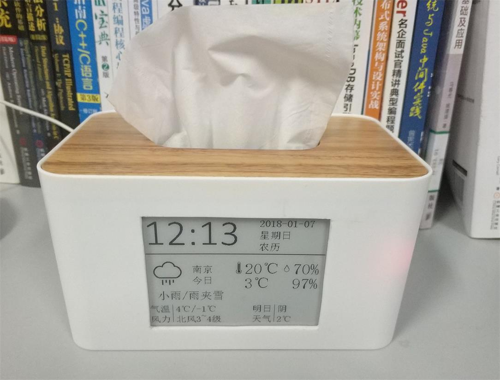

# e-Paper Weather Clock
Use RaspberryPi, DHT-22 humidity & temperature sensor, and WeShare 4.3 inch e-Paper screen, refered by https://github.com/emptyhua/epaper_clock

 ## Finished Product
 

## Hardware Connection
RaspberryPi 3B's GPIO

 | BCM | wPi |   Name  | Mode | V | Physical ||Physical | V | Mode | Name    | wPi | BCM |
 |:-:|:-:|:-:|:-:|:-:|:-:|:-:|:-:|:-:|:-:|:-:|:-:|:-:|
 |     |     |3.3v |      |   |  1 || 2|   |      | 5v|     |     |
 |   2 |   8 |   SDA.1 |   IN | 1 |  3 || 4  |   |      | 5v      |     |     |
 |   3 |   9 |   SCL.1 |   IN | 1 |  5 || 6  |   |      | 0v      |     |     |
 |   4 |   7 | GPIO. 7 |   IN | 1 |  7 || 8  | 1 | ALT5 | TxD     | 15  | 14  |
 |     |     |      0v |      |   |  9 || 10 | 1 | ALT5 | RxD     | 16  | 15  |
 |  17 |   0 | GPIO. 0 |   IN | 0 | 11 || 12 | 0 | IN   | GPIO. 1 | 1   | 18  |
 |  27 |   2 | GPIO. 2 |   IN | 0 | 13 || 14 |   |      | 0v      |     |     |
 |  22 |   3 | GPIO. 3 |   IN | 0 | 15 || 16 | 0 | IN   | GPIO. 4 | 4   | 23  |
 |     |     |    3.3v |      |   | 17 || 18 | 0 | IN   | GPIO. 5 | 5   | 24  |
 |  10 |  12 |    MOSI | ALT0 | 0 | 19 || 20 |   |      | 0v      |     |     |
 |   9 |  13 |    MISO | ALT0 | 0 | 21 || 22 | 0 | IN   | GPIO. 6 | 6   | 25  |
 |  11 |  14 |    SCLK | ALT0 | 0 | 23 || 24 | 1 | OUT  | CE0     | 10  | 8   |
 |     |     |      0v |      |   | 25 || 26 | 1 | OUT  | CE1     | 11  | 7   |
 |   0 |  30 |   SDA.0 |   IN | 1 | 27 || 28 | 1 | IN   | SCL.0   | 31  | 1   |
 |   5 |  21 | GPIO.21 |   IN | 1 | 29 || 30 |   |      | 0v      |     |     |
 |   6 |  22 | GPIO.22 |   IN | 1 | 31 || 32 | 0 | IN   | GPIO.26 | 26  | 12  |
 |  13 |  23 | GPIO.23 |   IN | 0 | 33 || 34 |   |      | 0v      |     |     |
 |  19 |  24 | GPIO.24 |  OUT | 1 | 35 || 36 | 1 | OUT  | GPIO.27 | 27  | 16  |
 |  26 |  25 | GPIO.25 |   IN | 0 | 37 || 38 | 0 | IN   | GPIO.28 | 28  | 20  |
 |     |     |      0v |      |   | 39 || 40 | 0 | IN   | GPIO.29 | 29  | 21  |

Connect to e-Paper screen

 |E-Paper Screen | Raspberry Pi |
 |:-:|:-:|
 | VCC | 3.3 |
 | GND | GND |
 | DIN | MOSI |
 | CLK | SCLK |
 | CS | 24 (Physical, BCM: CE0, 8) |
 | D/C | 22 (Physical, BCM: 25) |
 | RES | 11 (Physical, BCM: 17) |
 | BUSY| 18 (Physical, BCM: 24) |
 
 Connect to DHT-22 sensor
 
 |DHT22|Raspberry Pi|
 |:-:|:-:|
 |DOUT|GPIO7(BCM4)|
 
You can connect DHT-22's DOUT to RaspberryPi's other GPIO, as long as modify the second parameter of Adafruit_DHT.read function in main.py
 
 ## Install Python Library
 Install the following python library
 
 - RPi.GPIO
 - spidev
 - requests
 - lxml
 - Python Image Library(pillow)
 
 ## Install DHT-22 driver
 ```
 git clone https://github.com/adafruit/Adafruit_Python_DHT.git  
 cd Adafruit_Python_DHT  
 sudo python ./setup.py install 
 ```
 
 ## Usage
 1. Connect all wires
 2. Install all libraries or environments needed
 3. Run main.py
 
 ### How to set auto-start?
 方法二：使用systemd（推荐）
 Added script in /etc/rc.local(may not stable), or use systemd(recommend), following these steps:
 
 1. Write a epaper_clock.service script
 ```
[Unit]
Description=epaper_clock
[Service]
Type=oneshot
ExecStart=#####(path of your own script)#######
[Install]
WantedBy=multi-user.target
 ```
 2. Copy this script to /etc/systemd/system/multi-user.target.wants/ floder，and modify file authority using：chmod +x
 3. Start service: systemctl start epaper_clock.service
 4. Check sevice status: systemctl status epaper_clock.service
 5. Stop sevice: systemctl stop epaper_clock.service
 
 ## FAQ
 1. weather source may invalid, try to change another one
 2. network problem


————————————————————————————————————————————————————————————————————

# 电子墨水屏天气时钟
使用树莓派 + DHT22温湿度传感器 + 微雪4.3寸电子墨水屏搭建的天气时钟，参考了 https://github.com/emptyhua/epaper_clock 的创意。

 ## 效果图
 

## 硬件连接
树莓派3B GPIO接口图

 | BCM | wPi |   Name  | Mode | V | Physical ||Physical | V | Mode | Name    | wPi | BCM |
 |:-:|:-:|:-:|:-:|:-:|:-:|:-:|:-:|:-:|:-:|:-:|:-:|:-:|
 |     |     |3.3v |      |   |  1 || 2|   |      | 5v|     |     |
 |   2 |   8 |   SDA.1 |   IN | 1 |  3 || 4  |   |      | 5v      |     |     |
 |   3 |   9 |   SCL.1 |   IN | 1 |  5 || 6  |   |      | 0v      |     |     |
 |   4 |   7 | GPIO. 7 |   IN | 1 |  7 || 8  | 1 | ALT5 | TxD     | 15  | 14  |
 |     |     |      0v |      |   |  9 || 10 | 1 | ALT5 | RxD     | 16  | 15  |
 |  17 |   0 | GPIO. 0 |   IN | 0 | 11 || 12 | 0 | IN   | GPIO. 1 | 1   | 18  |
 |  27 |   2 | GPIO. 2 |   IN | 0 | 13 || 14 |   |      | 0v      |     |     |
 |  22 |   3 | GPIO. 3 |   IN | 0 | 15 || 16 | 0 | IN   | GPIO. 4 | 4   | 23  |
 |     |     |    3.3v |      |   | 17 || 18 | 0 | IN   | GPIO. 5 | 5   | 24  |
 |  10 |  12 |    MOSI | ALT0 | 0 | 19 || 20 |   |      | 0v      |     |     |
 |   9 |  13 |    MISO | ALT0 | 0 | 21 || 22 | 0 | IN   | GPIO. 6 | 6   | 25  |
 |  11 |  14 |    SCLK | ALT0 | 0 | 23 || 24 | 1 | OUT  | CE0     | 10  | 8   |
 |     |     |      0v |      |   | 25 || 26 | 1 | OUT  | CE1     | 11  | 7   |
 |   0 |  30 |   SDA.0 |   IN | 1 | 27 || 28 | 1 | IN   | SCL.0   | 31  | 1   |
 |   5 |  21 | GPIO.21 |   IN | 1 | 29 || 30 |   |      | 0v      |     |     |
 |   6 |  22 | GPIO.22 |   IN | 1 | 31 || 32 | 0 | IN   | GPIO.26 | 26  | 12  |
 |  13 |  23 | GPIO.23 |   IN | 0 | 33 || 34 |   |      | 0v      |     |     |
 |  19 |  24 | GPIO.24 |  OUT | 1 | 35 || 36 | 1 | OUT  | GPIO.27 | 27  | 16  |
 |  26 |  25 | GPIO.25 |   IN | 0 | 37 || 38 | 0 | IN   | GPIO.28 | 28  | 20  |
 |     |     |      0v |      |   | 39 || 40 | 0 | IN   | GPIO.29 | 29  | 21  |

与4.3寸电子墨水屏幕的连接

 |E-Paper Screen | Raspberry Pi |
 |:-:|:-:|
 | VCC | 3.3 |
 | GND | GND |
 | DIN | MOSI |
 | CLK | SCLK |
 | CS | 24 (Physical, BCM: CE0, 8) |
 | D/C | 22 (Physical, BCM: 25) |
 | RES | 11 (Physical, BCM: 17) |
 | BUSY| 18 (Physical, BCM: 24) |
 
 与DHT-22传感器的连接
 
 |DHT22|Raspberry Pi|
 |:-:|:-:|
 |DOUT|GPIO7(BCM4)|
 
 DHT-22 DOUT引脚也可以接到其他GPIO脚上，不过要相应的修改main.py中Adafruit_DHT.read函数第二个参数
 
 ## Python库
 安装以下库文件
 
 - RPi.GPIO
 - spidev
 - requests
 - lxml
 - Python Image Library(pillow)
 
 DHT22，安装厂商开源的驱动
 ```
 git clone https://github.com/adafruit/Adafruit_Python_DHT.git  
 cd Adafruit_Python_DHT  
 sudo python ./setup.py install 
 ```
 
 ## 使用方法
 1. 接好线
 2. 安装必须的环境和库
 3. 运行main.py
 
 ### 如何脚本设置开机启动？
 
 方法一：在/etc/rc.local中添加执行脚本。不太稳定，经常会出现各种奇怪的情况。
 方法二：使用systemd（推荐）
 
 1. 编写epaper_clock.service脚本
 ```
[Unit]
Description=epaper_clock
[Service]
Type=oneshot
ExecStart=#####(path of your own script)#######
[Install]
WantedBy=multi-user.target
 ```
 2. 将脚本拷贝到/etc/systemd/system/multi-user.target.wants/目录下，并修改文件执行权限：chmod +x
 3. 启动服务 systemctl start epaper_clock.service
 4. 查看服务状态 systemctl status epaper_clock.service
 5. 停止服务 systemctl stop epaper_clock.service
 
 ## 常见问题 FAQ
 1. 天气源失效，尝试换抓取页面或天气API
 2. 网络连接问题
